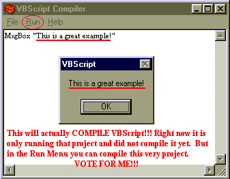



## VBScript Compiler\!\!This is for REAL\!\!

### Description

This code successfully compiles VBScript code into a .VBS which acts as an .EXE! It has many functions such as "Run" and "Last Run", along with the usual "New", "Open", and "Save" abilites! If you know VBScript (it is almost exactly the same as Visual Basic) then this program will be a temendous help. VOTE FOR THIS!!
 
### More Info
 

             |
---                |---
**Submitted On**   |2001-07-20 09:16:06
**By**             |[Alex M](https://github.com/Planet-Source-Code/PSCIndex/blob/master/ByAuthor/alex-m.md)
**Level**          |Intermediate
**User Rating**    |2.1 (39 globes from 19 users)
**Compatibility**  |VB 6\.0
**Category**       |[Miscellaneous](https://github.com/Planet-Source-Code/PSCIndex/blob/master/ByCategory/miscellaneous__1-1.md)
**World**          |[Visual Basic](https://github.com/Planet-Source-Code/PSCIndex/blob/master/ByWorld/visual-basic.md)
**Archive File**   |[VBScript C231527202001\.zip](https://github.com/Planet-Source-Code/alex-m-vbscript-compiler-this-is-for-real__1-25252/archive/master.zip)

